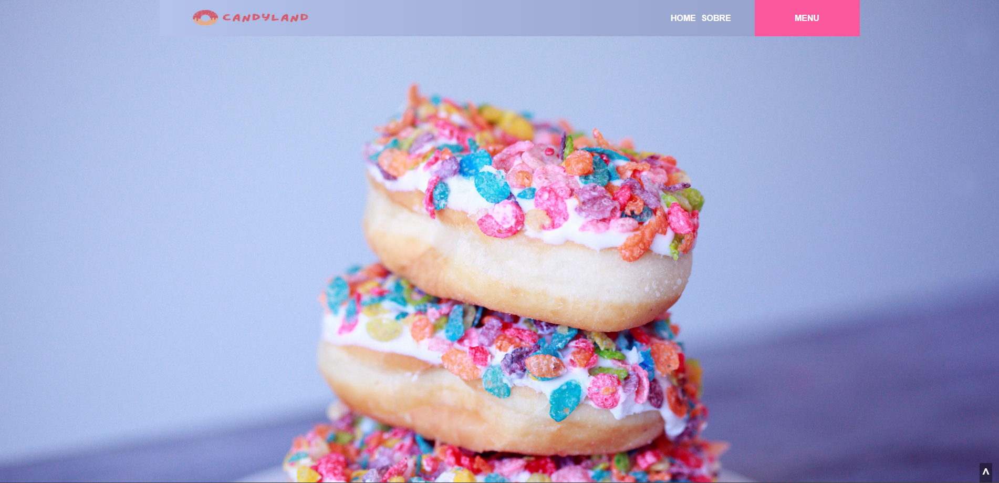

# Projeto Landing Page

## Doceria CandyLand

Esse é uma projeto proposto no módulo 3 do curso de Desenvolvedor FullStack da +Prati em parceria com a Codifica Edu.

Status do Projeto: concluido ✔️

## Imagem do projeto

## Descrição do Projeto

Esse projeto consiste em uma Landing Page referente a uma Doceria, não foi utilizado flexbox ou grid layout, totalmente feito em float e position, html bem estruturado, foi usado javascript para a criação da funcionalidade de modal, alert e scroll automático.

## Aprendizados

O que você aprendeu construindo esse projeto? Quais desafios você enfrentou e como você superou-os?

- Foi um projeto desafiador, pois existem funções bem mais fáceis de se utilizar que poderiam ter facilitado bastante a criação da página, mas a utilização de cada comando "ultrapassado", me deixará preparado para enfrentar desafios posteriormente.

- Projetos desse tipo forçam o estudante olhar a documentação da tecnologia, e eu vejo isso como um ponto positivo, pois nos prepara a entender como buscar e como funciona, pois o melhor curso que existe de cada linguagem é sua própria documentação.

## Licença

[MIT](https://choosealicense.com/licenses/mit/)

